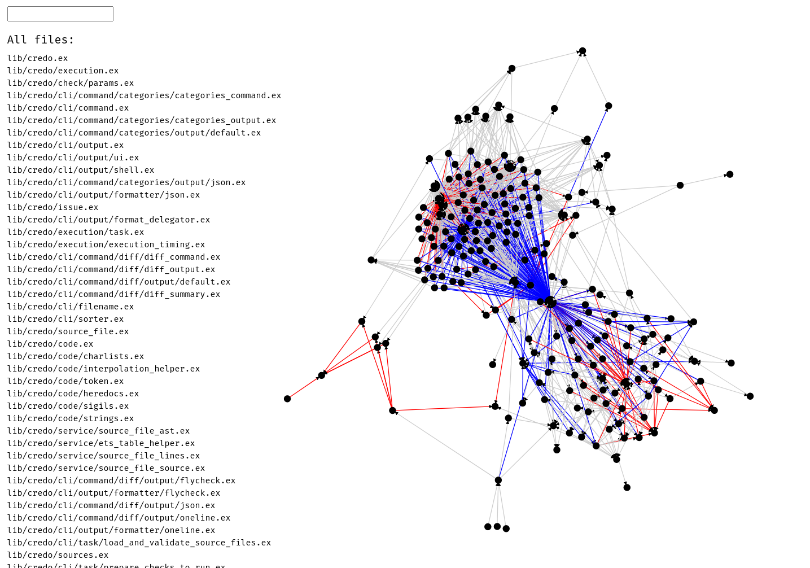
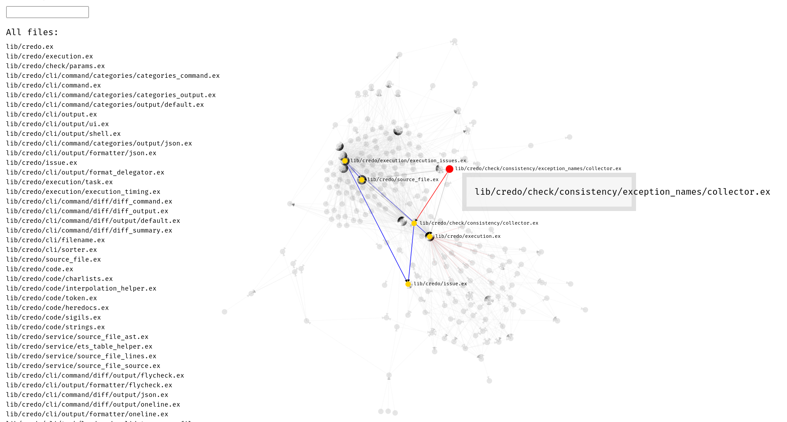

# DepViz

DepViz is a visual tool to understand Elixir recompilation.

The intent is to help developers rapidly understand what compilation dependencies they have in their project. Then they can take steps to minimize them to reduce the feedback loop between writing code and seeing results.

Helps you answer questions about the Elixir code base:
* Why when I change file A does it cause 100 files to recompile?
  * Investigate: What files will **cause this** file to recompile?
  * Investigate: What files does **this file cause** to recompile?

To start the server:

  * Install dependencies with `mix deps.get`
  * Install Node.js dependencies with `npm install` inside the `assets` directory
  * Start Phoenix endpoint with `mix phx.server`

Now visit [`localhost:4000`](http://localhost:4000) from your browser.

## Screenshots

## FAQ

* Is this usable with other graphs?
  - A: Not really, for example the graph algorithms needs to revisit the starting node if the starting node is itself part of a transitive compile time dependency chain
